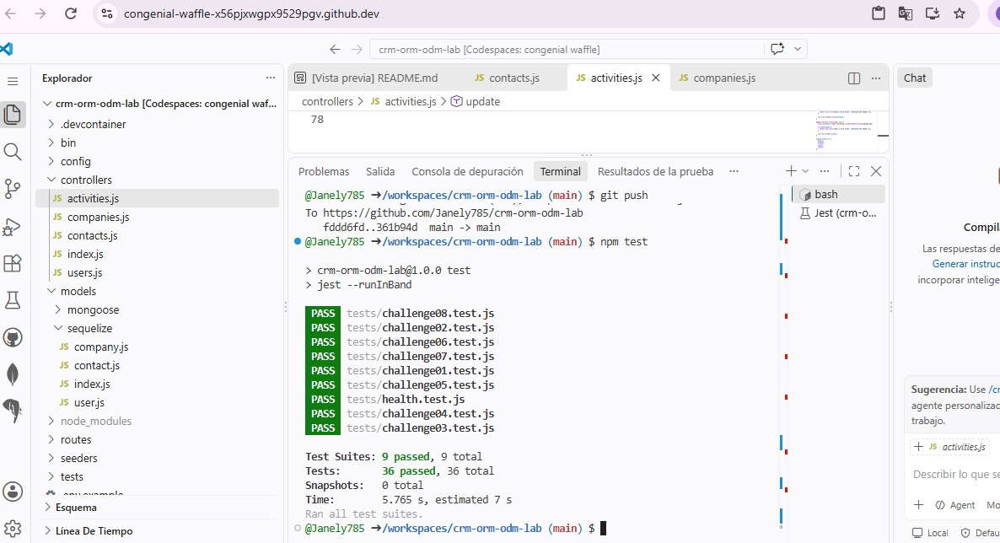

# CRM ORM/ODM Lab

API REST de un CRM básico que combina un ORM (Sequelize + PostgreSQL) y un ODM (Mongoose + MongoDB).

## Stack

- Node.js 22, Express 5, CommonJS
- Sequelize + PostgreSQL 16 (`User`, `Company`, `Contact`)
- Mongoose + MongoDB 7 (`Activity`)
- Jest + Supertest
- GitHub Codespaces, Dev Containers, Docker Compose
- Supervisor (`npm run dev`)

## Arquitectura

```text
GitHub Codespace
│
├── app       Node.js 22  ──┬── Sequelize ──> postgres (PostgreSQL)
│                           └── Mongoose  ──> mongo    (MongoDB)
├── postgres
└── mongo
```

La aplicación se conecta por nombre de servicio (`postgres`, `mongo`). Las credenciales de desarrollo llegan como variables de entorno definidas en `.devcontainer/docker-compose.yml` (ver `.env.example`).

## Iniciar el Codespace

1. En GitHub: **Code → Codespaces → Create codespace on main**.
2. Espera a que se levanten los tres servicios (`app`, `postgres`, `mongo`). `postCreateCommand` ejecuta `npm install`.

## Instalar dependencias

```bash
npm install
```

## Seed y reset

```bash
npm run seed    # inserta datos deterministas (3 users, 4 companies, 8 contacts, 10 activities)
npm run reset   # elimina y recrea tablas/base de datos y vuelve a sembrar
```

## Iniciar la API

```bash
npm start       # node ./bin/www
npm run dev     # supervisor ./bin/www
```

Servidor en el puerto `3000` (variable `PORT`).

## Pruebas

```bash
npm test
```

Cada suite restablece PostgreSQL y MongoDB antes de ejecutarse y cierra las conexiones al terminar.

## Endpoints

| Método | Ruta | Descripción |
|---|---|---|
| GET | `/health` | Health check |
| GET | `/users` | Listar usuarios |
| GET | `/users/:id` | Obtener usuario |
| POST | `/users` | Crear usuario |
| PUT | `/users/:id` | Actualizar usuario |
| DELETE | `/users/:id` | Eliminar usuario |
| GET | `/companies` | Listar compañías (`?industry=`) |
| GET | `/companies/:id` | Obtener compañía |
| POST | `/companies` | Crear compañía |
| PUT | `/companies/:id` | Actualizar compañía |
| DELETE | `/companies/:id` | Eliminar compañía |
| GET | `/contacts` | Listar contactos |
| GET | `/contacts/:id` | Obtener contacto |
| POST | `/contacts` | Crear contacto |
| PUT | `/contacts/:id` | Actualizar contacto |
| DELETE | `/contacts/:id` | Eliminar contacto |
| GET | `/activities` | Listar actividades (`?type=`) |
| GET | `/activities/:id` | Obtener actividad |
| POST | `/activities` | Crear actividad |
| PUT | `/activities/:id` | Actualizar actividad |
| DELETE | `/activities/:id` | Eliminar actividad |

Los errores se devuelven como JSON: `{ "error": "Contact not found" }`.

## Respuestas

**1. Dos motores.**
Activity es buena candidata para una base documental porque su metadata cambia de forma según el tipo de actividad ya sea call, email o meeting, y un documento json permite guardar esos campos distintos sin definir columnas fijas para cada caso. Pero company y contact encajan mejor en una base relacional como PostgreSQL y MySQL porque su estructura es fija y tienen una relación clara entre sí, debido a sus foreign keys.

**2. ORM vs ODM.**
Un ORM mapea objetos a filas de una tabla en este caso, Sequelize, usado con PostgreSQL. Un ODM mapea objetos a documentos de una base no relacional que es cuando se guardan documentos independientes,  aquí es Mongoose, usado con MongoDB. La diferencia importante es que Sequelize exige una estructura de columnas fija por tabla, mientras que Mongoose permite que cada documento tenga campos distintos como en metadata de activity.

**3. Configuración por variables de entorno.**
Se definen en .devcontainer/docker-compose.yml como variables de entorno del contenedor app. Ponerlas directo en los .js es mala práctica porque quedarían visibles en el repositorio para cualquiera, y cambiar de entorno obligaría a tocar el código. DB_HOS` y MONGODB_URI no son localhost porque PostgreSQL y MongoDB corren en sus propios contenedores (postgres y mongo), así que desde el contenedor app se accede a ellos por el nombre del servicio, no por la propia máquina.

**4. Asociaciones.**
En models/sequelize/index.js se define una relación uno a muchos entre company y contact, una compañía puede tener varios contactos. La foreign key es companyId y vive en la tabla Contact. El alias “as:contacts” define el nombre de la propiedad donde aparecerán los contactos relacionados cuando se use include en una consulta.
**5. Eager loading.**
Traer la compañía y después hacer otra consulta para sus contactos implica dos viajes separados a la base de datos. Usar include hace un solo join y trae todo junto en una sola consulta. El include  es más eficiente, sobre todo si esto se repite para varias compañías al mismo tiempo.

**6. Instancia vs consulta.**
Buscar la instancia con findByPk y luego llamar a .update() permite validar los datos y devuelve directamente el objeto ya actualizado, listo para mandarlo en la respuesta. Model.update({...}, { where }) hace la actualización en una sola consulta SQL, que es mas rapida, pero no siempre regresa las filas modificadas, así que si se necesita responder con el dato actualizado hay que hacer otra consulta aparte.

**7. Esquema flexible.**
En models/mongoose/activity.js, el metadata se define como tipo Mixed, lo que le permite aceptar cualquier estructura sin que Mongoose la valide contra un formato fijo. Por eso puede guardar campos distintos según sea call, email o meeting. La desventaja es que se pierde la validación automática de esos campos, osea,  si llega mal formado, el esquema no lo detecta.
**8. Sin ref.**
No se puede usar ref`/`populate porque esa función solo conecta documentos dentro de la misma base de MongoDB. contactId y userId apuntan a registros que están en PostgreSQL, otra base distinta, así que Mongoose no tiene forma de poblarlos. Esto significa que no hay integridad referencial automática: si se borra un User en PostgreSQL, las actividades que lo referencian por userId se quedan con ese id "huérfano" sin que nada lo avise.
**9. Documento actualizado.**
Antes de corregirlo, findByIdAndUpdate() devolvía el documento como estaba antes del cambio, porque asi se comporta por defecto. Para que regresara el documento ya actualizado agregué la opción { new: true }, y también { runValidators: true } para que los cambios se validen contra el esquema.
**10. Pruebas de comportamiento.**
Probar la respuesta de la API en vez de revisar qué método se usó por dentro da libertad para resolver cada reto como uno quiera, sin que la prueba se rompa por detalles de implementación. A parte se parece más a cómo un cliente real usaría la API, así que es un mejor indicador de que todo funciona de principio a fin.
**11. Repetibilidad.**
tests/setup.js borra y vuelve a crear las bases de datos de PostgreSQL y MongoDB antes de cada suite, y cierra las conexiones al terminar. Es muy importante porque si quedaran datos de una prueba anterior, otra prueba podría fallar o pasar dependiendo de ese estado previo, entonces al reiniciar los datos siempre se arranca del mismo punto y npm test da resultados consistentes.
**12. Tu experiencia.**
El reto que más se me complicó fue el Reto 08, porque tuve problemas al actualizar las actividades en MongoDB. Para resolverlo, revisé el funcionamiento de finByIdAnUpdate()y corregí la actualización para que devolviera los datos nuevos y permitiera modificar la metadata. Un error de Jest que me ayudó fue "Expected: 'Llamada actualizada', Received: 'Llamada de seguimiento'", ya que me permitió identificar que la respuesta seguía mostrando la descripción anterior. También tuve un error al actualizar la metadata, lo que me ayudó a detectar que esos cambios tampoco se reflejaban en la respuesta.

